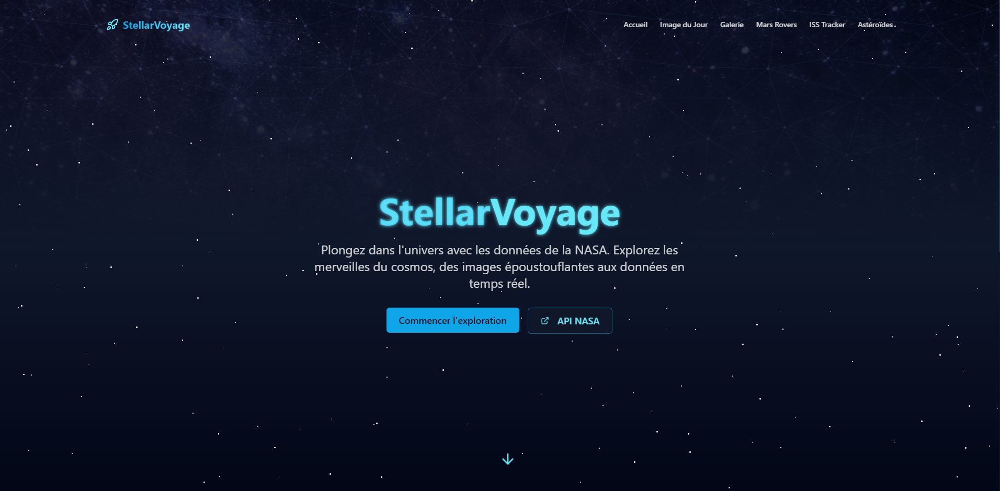

# 🚀 StellarVoyage – Exploration interactive de l’univers avec la NASA

**StellarVoyage** est une application web immersive qui vous plonge dans l'exploration spatiale grâce aux données publiques de la NASA.  
Découvrez l’univers à travers des images époustouflantes, suivez la station spatiale internationale, explorez Mars et apprenez-en plus sur les astéroïdes proches de la Terre.

---

## 🔗 Démo

Accédez à l'application en ligne :  
🚀 [StellarVoyage](https://stellarvoyage.netlify.app/)

---

## 🖼️ Aperçu

  
*Des captures d'écran seront ajoutées prochainement pour illustrer l'interface.*

---

## ✨ Fonctionnalités principales

- 🌠 **APOD (Astronomy Picture of the Day)** : Une image fascinante chaque jour, accompagnée de ses explications scientifiques.
- 🖼️ **Galerie spatiale** : Parcourez une collection de photos issues des missions spatiales.
- 🛰️ **Localisation de l’ISS** : Suivi en temps réel de la Station Spatiale Internationale.
- 🚀 **Rovers martiens** : Visualisez les photos prises sur Mars par les rovers.
- 🌍 **Astéroïdes proches de la Terre** : Accédez aux données en temps réel sur les objets proches de la Terre.

---

## 🛠️ Technologies utilisées

### 🔧 Frontend
- 
- 
- 

### 🎨 UI & Animation
- 
- 
- ✨ Animations personnalisées (CSS & Tailwind)

### 📡 Données & API
- 📊 APIs publiques de la [NASA](https://api.nasa.gov/)
- 
- 

---

## 🚀 Installation locale

```bash
# Cloner le dépôt
git clone https://github.com/votre-utilisateur/stellarvoyage.git

# Aller dans le dossier du projet
cd stellarvoyage

# Installer les dépendances
npm install

# Lancer le serveur de développement
npm run dev
```

## 🌐 Variables d'Environnement

Créez un fichier `.env` à la racine du projet et ajoutez :
```
VITE_NASA_API_KEY=votre_cle_api_nasa
```
🔐 Vous pouvez obtenir votre clé gratuitement sur [api.nasa.gov](https://api.nasa.gov/)

## 🤝 Contribution

Les contributions sont les bienvenues ! N'hésitez pas à ouvrir une issue ou à proposer une pull request.

## 📄 Licence

Ce projet est sous licence MIT - voir le fichier [LICENSE](LICENSE) pour plus de détails.